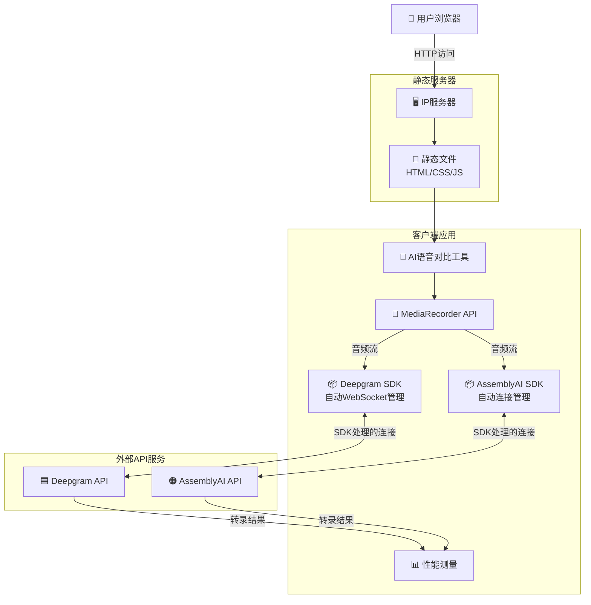
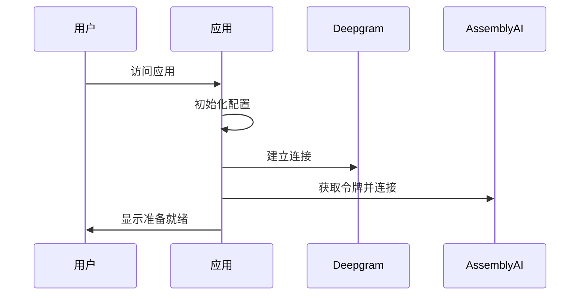
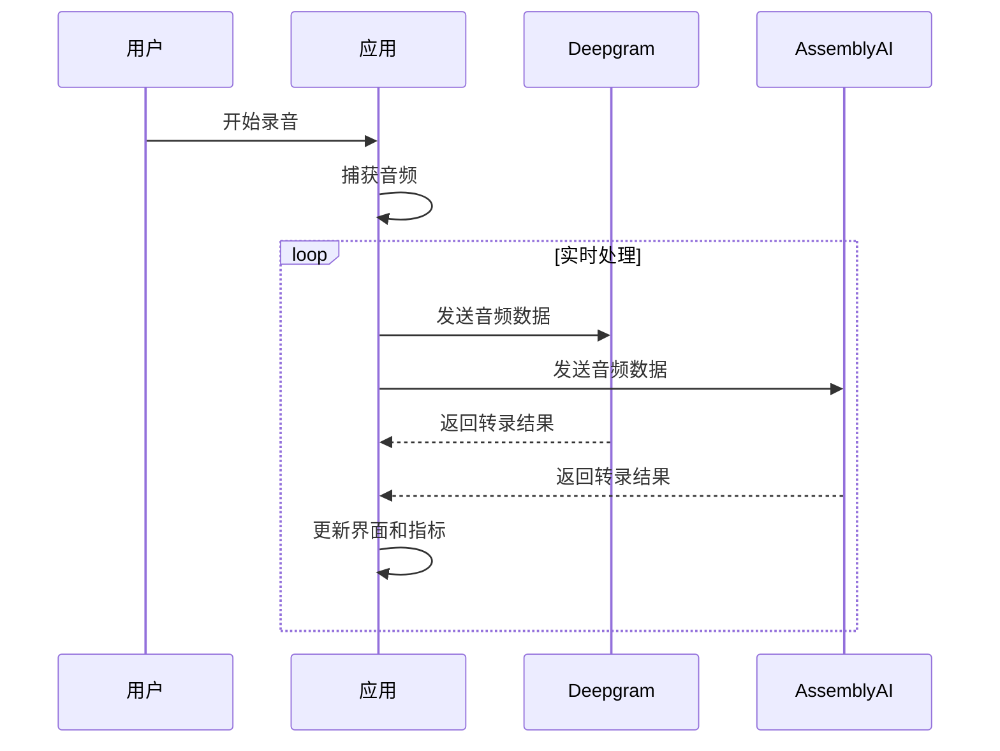

# AI语音对比工具 Fullstack架构文档

## 引言

本文档为AI语音对比工具定义了完整的全栈架构，涵盖前端实现、API集成和部署策略。该工具专门用于实时对比Deepgram和AssemblyAI语音转文字API的性能。

### 起始模板或现有项目

**决定**: 绿地项目 - 自定义轻量级项目结构

基于PRD明确要求使用"原生JavaScript (ES6+) + Web APIs"，我们选择不使用框架起始模板，而是创建自定义的轻量级项目结构。这种选择符合快速交付和保持轻量级的要求。

### 变更日志

| 日期 | 版本 | 描述 | 作者 |
|------|------|------|------|
| 2025-01-22 | v1.0 | 基于PRD v1.0和UX设计创建初始架构文档 | Winston (Architect) |

## 高层架构

### 技术概述

本AI语音对比工具采用现代化的纯前端单页应用架构，通过原生JavaScript和Web APIs直接连接Deepgram和AssemblyAI的实时语音转录服务。应用采用模块化ES6+架构，利用官方SDK处理WebSocket通信，通过MediaRecorder API捕获音频流，并实现精确的性能指标测量系统。整个系统部署在静态服务器上，通过HTTPS确保安全的麦克风访问，同时提供响应式的双面板对比界面，让用户能够在2分钟内完成完整的API性能评估。

### 平台和基础设施选择

**平台:** 直接IP服务器部署  
**关键服务:** 静态文件服务、HTTPS支持  
**部署主机和区域:** 用户自有服务器

**选择理由:**
- 完全控制部署环境
- 无第三方服务依赖
- 成本可控，使用现有服务器资源
- 简单直接的部署流程

### 仓库结构

**结构:** 单仓库 (Single Repository)  
**Monorepo工具:** 不适用 - 项目规模较小，使用标准文件组织  
**包组织:** 扁平化结构，按功能模块组织

### 高层架构图



### 架构模式

- **Jamstack架构:** 静态站点与客户端API调用 - _理由:_ 最优的性能和简单性，符合纯前端需求
- **模块模式:** ES6模块化组件架构 - _理由:_ 代码组织清晰，便于维护
- **观察者模式:** 事件驱动的状态管理 - _理由:_ 实时数据流需要响应式更新
- **策略模式:** 可插拔的API适配器 - _理由:_ 支持不同API的统一接口
- **外观模式:** 复杂API通信的简化接口 - _理由:_ 隐藏SDK复杂性，提供统一的调用接口

## 技术栈

### 技术栈表

| 类别 | 技术 | 版本 | 用途 | 选择理由 |
|------|------|------|------|----------|
| 前端语言 | JavaScript | ES2022+ | 客户端逻辑和DOM操作 | 原生JS符合PRD轻量级要求，ES2022+提供现代语法支持 |
| 前端框架 | Vanilla JS | Latest | 无框架纯原生开发 | PRD明确要求避免大型框架，保持轻量级 |
| UI组件库 | Custom CSS + Components | 1.0 | 自定义组件系统 | 基于UX设计的定制组件，完全控制样式和行为 |
| 状态管理 | Event-driven Classes | Native | 应用状态和数据流管理 | 原生事件系统足够处理实时数据流，无需外部库 |
| 音频处理 | MediaRecorder API | Native | 浏览器音频捕获 | 标准Web API，跨浏览器兼容，符合PRD音频需求 |
| Deepgram集成 | @deepgram/sdk | Latest | 实时语音转录 | 官方SDK处理所有WebSocket连接和协议细节 |
| AssemblyAI集成 | assemblyai | Latest | 实时语音转录 | 官方SDK简化集成，处理连接管理 |
| CSS框架 | CSS3 + Custom Properties | Native | 样式和响应式布局 | CSS变量和Grid/Flexbox满足UX设计需求 |
| 版本控制 | Git | Latest | 源代码版本控制 | 行业标准 |
| 部署 | 静态文件服务器 | Latest | 直接IP部署 | 简单直接，用户完全控制 |
| HTTPS/SSL | 服务器配置 | Auto | 安全连接和麦克风访问 | 自配置HTTPS确保麦克风API访问 |
| 性能监控 | Performance API | Native | 前端性能指标 | 原生浏览器API，轻量级性能监控 |

## 数据模型

### VoiceComparisonSession - 语音对比会话

**目的:** 表示一次完整的语音对比测试会话，包含配置、状态和结果数据

**主要属性:**
- sessionId: string - 唯一会话标识符
- startTime: Date - 会话开始时间
- endTime: Date | null - 会话结束时间
- deepgramResults: TranscriptionResult[] - Deepgram转录结果数组
- assemblyaiResults: TranscriptionResult[] - AssemblyAI转录结果数组
- metrics: SessionMetrics - 会话性能指标

#### TypeScript接口
```typescript
interface VoiceComparisonSession {
  sessionId: string;
  startTime: Date;
  endTime: Date | null;
  deepgramResults: TranscriptionResult[];
  assemblyaiResults: TranscriptionResult[];
  metrics: SessionMetrics;
}
```

### TranscriptionResult - 转录结果

**目的:** 存储单个API的实时转录结果，包含文本、时间戳和元数据

**主要属性:**
- provider: ApiProvider - API提供商（Deepgram或AssemblyAI）
- text: string - 转录文本内容
- confidence: number - 置信度分数
- isFinal: boolean - 是否为最终结果
- timestamp: Date - 接收时间戳
- latency: number - 响应延迟（毫秒）

#### TypeScript接口
```typescript
interface TranscriptionResult {
  provider: ApiProvider;
  text: string;
  confidence: number;
  isFinal: boolean;
  timestamp: Date;
  latency: number;
}
```

## API规格说明

### Deepgram实时转录SDK集成

**连接方式**: 使用Deepgram JavaScript SDK，SDK内部管理WebSocket连接

**核心API方法**:
```typescript
// 客户端初始化
const deepgramClient = deepgram.createClient(DEEPGRAM_API_KEY);

// 建立实时连接
const connection = deepgramClient.listen.live({
  model: "nova-2",
  language: "en",
  smart_format: true,
  sample_rate: 48000
});

// 事件监听
connection.on(deepgram.LiveTranscriptionEvents.Transcript, (data) => {
  const transcript = data.channel.alternatives[0].transcript;
  // 处理转录结果
});

// 发送音频数据
connection.send(audioBlob);
```

### AssemblyAI实时转录SDK集成

**连接方式**: 使用AssemblyAI Node SDK的StreamingTranscriber，需要临时令牌认证

**客户端实现**:
```typescript
// 获取临时令牌
async function getAssemblyAIToken() {
  const response = await fetch('https://api.assemblyai.com/v2/realtime/token', {
    method: 'POST',
    headers: {
      'Authorization': `Bearer ${ASSEMBLYAI_API_KEY}`,
      'Content-Type': 'application/json'
    },
    body: JSON.stringify({ expires_in: 3600 })
  });
  const data = await response.json();
  return data.token;
}

// 初始化流转录器
const token = await getAssemblyAIToken();
const rt = new StreamingTranscriber({
  token: token,
  sampleRate: 48000
});

// 事件监听
rt.on("turn", ({ transcript }) => {
  // 处理转录结果
});
```

## 组件架构

### AudioCaptureManager - 音频捕获管理器

**职责:** 管理浏览器音频捕获、权限请求和音频流处理

**关键接口:**
- `initialize()` - 初始化音频捕获设备
- `startCapture()` - 开始音频录制
- `stopCapture()` - 停止音频录制
- `onAudioData(callback)` - 注册音频数据回调

**技术栈:** 原生Web Audio API, MediaRecorder API，支持WebM/Opus编码

### DeepgramConnector - Deepgram API连接器

**职责:** 管理与Deepgram实时转录服务的连接和通信

**关键接口:**
- `connect(apiKey, options)` - 建立WebSocket连接
- `sendAudio(audioBlob)` - 发送音频数据
- `onTranscript(callback)` - 转录结果回调
- `disconnect()` - 断开连接

**技术栈:** Deepgram JavaScript SDK v5.x，自动WebSocket管理

### AssemblyAIConnector - AssemblyAI API连接器

**职责:** 管理与AssemblyAI实时转录服务的连接，包括令牌管理

**关键接口:**
- `connect(token, options)` - 建立流转录连接
- `sendAudio(audioBuffer)` - 发送音频数据
- `refreshToken()` - 刷新临时令牌
- `disconnect()` - 断开连接

**技术栈:** AssemblyAI Node SDK最新版，StreamingTranscriber类

### PerformanceTracker - 性能追踪器

**职责:** 测量和计算实时转录的性能指标

**关键接口:**
- `startMeasurement(provider, audioId)` - 开始性能测量
- `recordTranscript(audioId, transcript, timestamp)` - 记录转录结果
- `getLatencyStats(provider)` - 获取延迟统计

**技术栈:** Performance API, 高精度时间戳

## 外部API集成

### Deepgram API

- **目的:** 实时语音转文字转录服务
- **文档:** https://developers.deepgram.com/docs
- **基础URL:** wss://api.deepgram.com/v1/listen
- **认证:** API密钥认证
- **速率限制:** 基于订阅计划

**集成说明:** 使用官方@deepgram/sdk处理所有WebSocket通信，支持直接发送音频Blob数据

### AssemblyAI API

- **目的:** 实时语音转文字转录服务
- **文档:** https://www.assemblyai.com/docs
- **基础URL:** wss://api.assemblyai.com/v2/realtime/ws
- **认证:** 临时令牌认证
- **速率限制:** 基于订阅计划

**集成说明:** 使用官方assemblyai SDK，需要ArrayBuffer格式音频数据，临时令牌机制增强安全性

## 核心工作流程

### 应用初始化和连接建立



### 音频录制和实时转录



## 数据库架构

采用**无数据库架构** - 所有数据存储在浏览器localStorage中：

```typescript
interface LocalStorageSchema {
  currentSession: {
    sessionId: string;
    startTime: string;
    deepgramResults: string[];
    assemblyaiResults: string[];
    deepgramLatencies: number[];
    assemblyaiLatencies: number[];
  } | null;
  
  userConfig: {
    deepgramApiKey: string;
    assemblyaiApiKey: string;
    sampleRate: number;
  };
}
```

## 前端架构

### 组件架构

#### 组件组织
```
src/
├── index.html          # 主页面
├── styles.css          # 全部样式
├── app.js              # 主应用逻辑
└── README.md           # 部署说明
```

#### 组件模板
```typescript
class VoiceComparison {
  constructor() {
    this.deepgramConnected = false;
    this.assemblyaiConnected = false;
    this.isRecording = false;
  }
  
  async init() {
    await this.connectAPIs();
    this.setupEventListeners();
  }
}
```

### 状态管理架构

```typescript
const AppState = {
  connections: {
    deepgram: 'disconnected',
    assemblyai: 'disconnected'
  },
  recording: {
    isActive: false,
    startTime: null
  },
  transcripts: {
    deepgram: [],
    assemblyai: []
  },
  metrics: {
    deepgramLatencies: [],
    assemblyaiLatencies: []
  }
};
```

## 后端架构

### 服务架构

采用**纯前端架构** - 无后端服务器：

```
部署结构:
server/
├── index.html          # 主页面
├── styles.css          # 样式文件
├── app.js              # 主应用逻辑
└── README.md           # 部署说明
```

### API密钥管理

```javascript
// 在app.js中直接配置
const CONFIG = {
  DEEPGRAM_API_KEY: 'your_deepgram_api_key_here',
  ASSEMBLYAI_API_KEY: 'your_assemblyai_api_key_here'
};
```

## 统一项目结构

```
ai-voice-compare/
├── index.html          # 主页面
├── styles.css          # 样式文件  
├── app.js              # 主应用逻辑
└── README.md           # 部署说明
```

## 开发工作流程

### 本地开发设置

#### 前置要求
```bash
# 无需安装任何依赖
# 只需要现代浏览器和文本编辑器
```

#### 初始设置
```bash
# 1. 编辑app.js中的API密钥
# 2. 使用本地服务器测试(可选)
python -m http.server 8000
# 或直接打开index.html
```

### 环境配置

```javascript
// 在app.js文件开头直接设置
const DEEPGRAM_API_KEY = 'your_key_here';
const ASSEMBLYAI_API_KEY = 'your_key_here';
```

## 部署架构

### 部署策略

**前端部署:**
- **平台:** 直接IP服务器
- **构建命令:** 无需构建
- **输出目录:** 直接上传所有文件

### 环境

| 环境 | 前端URL | 用途 |
|------|---------|------|
| 生产环境 | http://your-ip/ai-voice-compare/ | 直接使用 |

## 安全和性能

### 安全要求

**前端安全:**
- API密钥硬编码在代码中（内部使用可接受）
- 通过IP访问限制

### 性能优化

**前端性能:**
- 文件大小目标: <100KB总大小
- 加载策略: 同步加载所有资源
- 缓存策略: 浏览器默认缓存

## 测试策略

### 测试组织

```
手动测试:
1. 打开页面
2. 输入API密钥（如果需要）
3. 点击开始录音
4. 说话测试
5. 查看结果对比
```

## 编码标准

### 关键规则

- **直接实现:** 所有功能在app.js中实现
- **无依赖:** 不使用任何外部库（除了API SDK）
- **内联配置:** API密钥直接写在代码中

## 错误处理策略

### 统一错误处理

```typescript
class APIErrorHandler {
  static handleDeepgramError(error) {
    if (error.code === 4001) {
      return "Deepgram API密钥无效";
    }
    return "Deepgram连接错误";
  }
  
  static handleAssemblyAIError(error) {
    if (error.message.includes('token')) {
      return "AssemblyAI令牌无效或已过期";
    }
    return "AssemblyAI服务错误";
  }
}
```

## 监控和可观测性

### 监控栈

- **前端监控:** Performance API原生指标
- **错误追踪:** Console.log调试信息
- **性能监控:** 延迟和连接状态实时显示

### 关键指标

**前端指标:**
- API响应延迟
- 转录准确性对比
- 连接稳定性
- 音频质量

---

*本架构文档基于PRD v1.0和UX设计，专为简单测试需求优化*