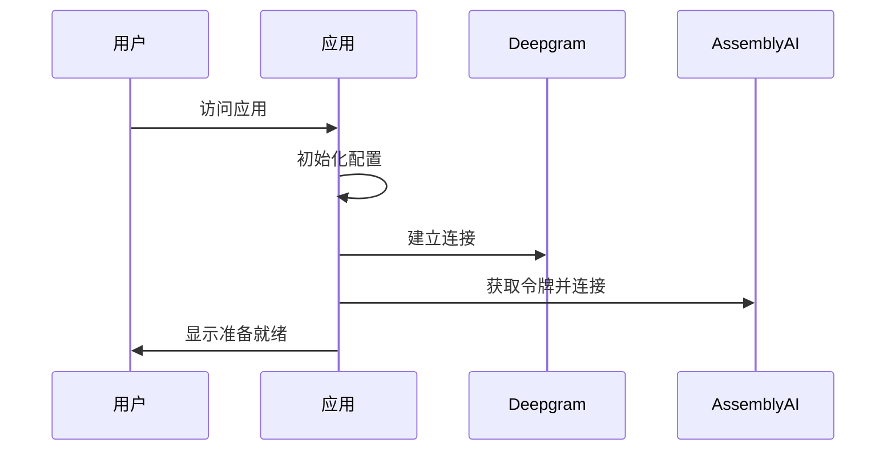
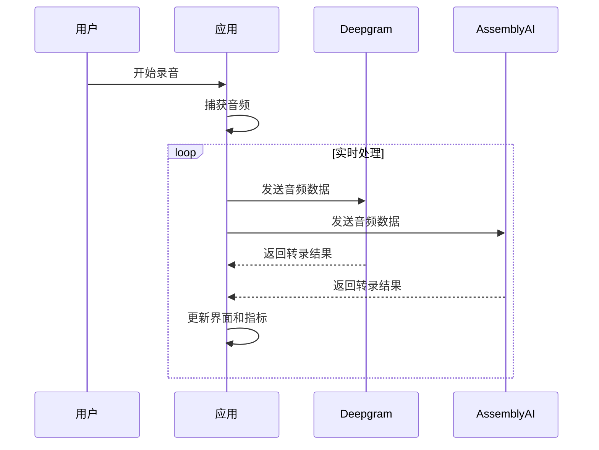

# 核心工作流程

## 应用初始化和连接建立

```mermaid
sequenceDiagram
    participant User as 用户
    participant App as 应用
    participant DG as Deepgram
    participant AI as AssemblyAI

    User->>App: 访问应用
    App->>App: 初始化配置
    App->>DG: 建立连接
    App->>AI: 获取令牌并连接
    App->>User: 显示准备就绪
```

## 音频录制和实时转录

```mermaid
sequenceDiagram
    participant User as 用户
    participant App as 应用
    participant DG as Deepgram
    participant AI as AssemblyAI

    User->>App: 开始录音
    App->>App: 捕获音频
    
    loop 实时处理
        App->>DG: 发送音频数据
        App->>AI: 发送音频数据
        DG-->>App: 返回转录结果
        AI-->>App: 返回转录结果
        App->>App: 更新界面和指标
    end
```
