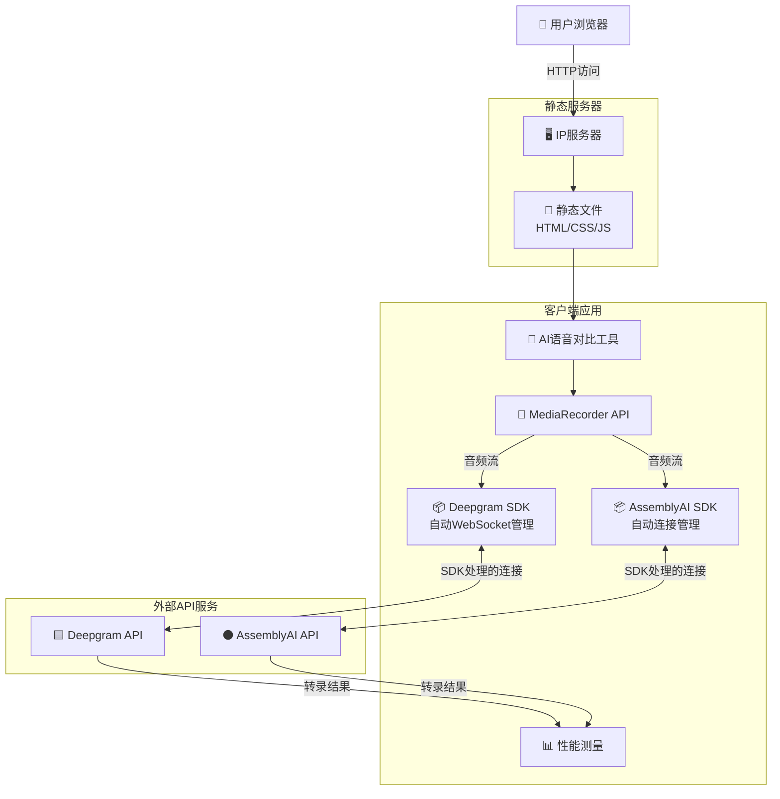

# 高层架构

## 技术概述

本AI语音对比工具采用现代化的纯前端单页应用架构，通过原生JavaScript和Web APIs直接连接Deepgram和AssemblyAI的实时语音转录服务。应用采用模块化ES6+架构，利用官方SDK处理WebSocket通信，通过MediaRecorder API捕获音频流，并实现精确的性能指标测量系统。整个系统部署在静态服务器上，通过HTTPS确保安全的麦克风访问，同时提供响应式的双面板对比界面，让用户能够在2分钟内完成完整的API性能评估。

## 平台和基础设施选择

**平台:** 直接IP服务器部署  
**关键服务:** 静态文件服务、HTTPS支持  
**部署主机和区域:** 用户自有服务器

**选择理由:**
- 完全控制部署环境
- 无第三方服务依赖
- 成本可控，使用现有服务器资源
- 简单直接的部署流程

## 仓库结构

**结构:** 单仓库 (Single Repository)  
**Monorepo工具:** 不适用 - 项目规模较小，使用标准文件组织  
**包组织:** 扁平化结构，按功能模块组织

## 高层架构图

## 架构模式

- **Jamstack架构:** 静态站点与客户端API调用 - _理由:_ 最优的性能和简单性，符合纯前端需求
- **模块模式:** ES6模块化组件架构 - _理由:_ 代码组织清晰，便于维护
- **观察者模式:** 事件驱动的状态管理 - _理由:_ 实时数据流需要响应式更新
- **策略模式:** 可插拔的API适配器 - _理由:_ 支持不同API的统一接口
- **外观模式:** 复杂API通信的简化接口 - _理由:_ 隐藏SDK复杂性，提供统一的调用接口
