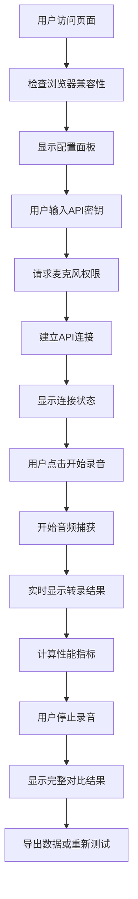
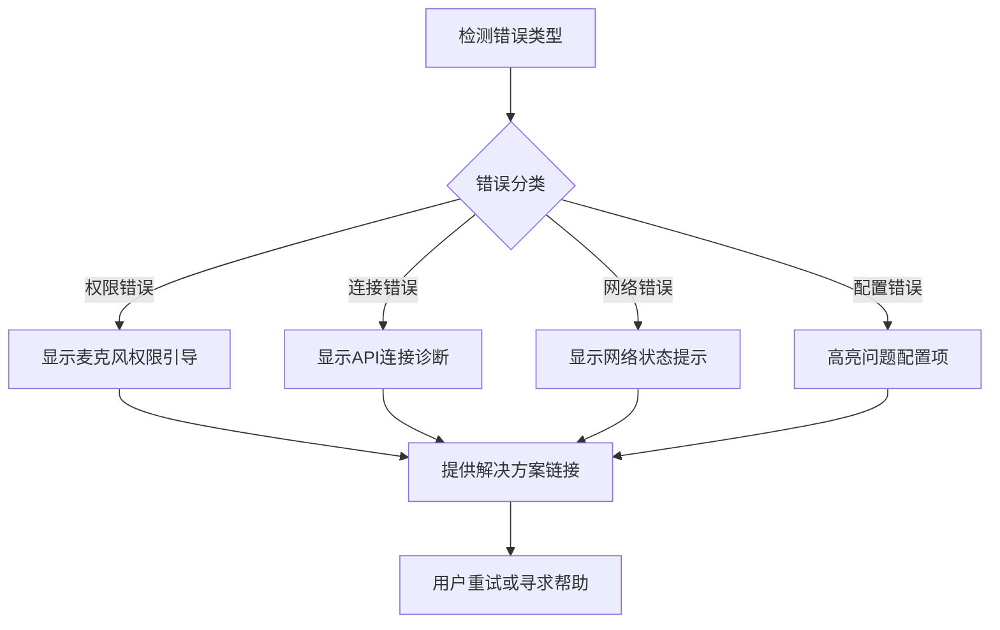

# AI语音对比工具 - UX设计文档

## 设计概述

基于PRD文档，本设计文档为AI语音对比工具提供全面的用户体验设计指导，确保创建简洁直观的实时对比界面，让用户能够在2分钟内完成完整的对比测试。

## 信息架构

### 主要内容区域

```
┌─────────────────────────────────────────────────┐
│                  页头 (Header)                   │
│  AI语音对比工具 | Deepgram vs AssemblyAI        │
├─────────────────────────────────────────────────┤
│               配置面板 (可折叠)                  │
│  [API密钥设置] [音频参数配置]                   │
├─────────────────────────────────────────────────┤
│                录音控制区域                      │
│  [状态指示器] [开始/停止] [音频电平]            │
├─────────────────────────────────────────────────┤
│              实时转录对比面板                    │
│  ┌─────────────────┐ ┌─────────────────┐        │
│  │   Deepgram     │ │   AssemblyAI   │        │
│  │   [蓝色主题]    │ │   [橙色主题]    │        │
│  │                │ │                │        │
│  │ 实时转录文本... │ │ 实时转录文本... │        │
│  │ 延迟: 120ms    │ │ 延迟: 145ms    │        │
│  └─────────────────┘ └─────────────────┘        │
├─────────────────────────────────────────────────┤
│               性能指标面板                       │
│  [平均延迟] [总词数] [连接稳定性] [会话统计]     │
├─────────────────────────────────────────────────┤
│               错误/状态消息                      │
│  [系统提示和错误信息]                           │
├─────────────────────────────────────────────────┤
│                 页脚 (Footer)                   │
│  版权信息和技术说明                             │
└─────────────────────────────────────────────────┘
```

### 导航层次

1. **主要操作层** - 录音控制（开始/停止/清除）
2. **配置层** - API设置和音频参数（可折叠）
3. **结果显示层** - 双面板转录结果
4. **分析层** - 性能指标和统计数据

## 交互流程设计

### 主要用户流程



### 错误处理流程



## 视觉设计系统

### 色彩体系

#### 主要品牌色
- **Deepgram蓝**: `#2563EB` (主色), `#DBEAFE` (浅色), `#1E40AF` (深色)
- **AssemblyAI橙**: `#EA580C` (主色), `#FED7AA` (浅色), `#C2410C` (深色)
- **中性灰**: `#6B7280` (文本), `#F3F4F6` (背景), `#E5E7EB` (边界)

#### 状态色彩
- **成功/连接**: `#059669`
- **警告/等待**: `#D97706`
- **错误/断开**: `#DC2626`
- **信息/处理**: `#2563EB`

### 字体系统

```css
/* 主要字体层次 */
--font-family-primary: 'Inter', -apple-system, BlinkMacSystemFont, 'Segoe UI', sans-serif;
--font-family-mono: 'SF Mono', 'Monaco', 'Inconsolata', monospace;

/* 字体大小 */
--text-xs: 0.75rem;    /* 12px */
--text-sm: 0.875rem;   /* 14px */
--text-base: 1rem;     /* 16px */
--text-lg: 1.125rem;   /* 18px */
--text-xl: 1.25rem;    /* 20px */
--text-2xl: 1.5rem;    /* 24px */
--text-3xl: 1.875rem;  /* 30px */

/* 字重 */
--font-weight-normal: 400;
--font-weight-medium: 500;
--font-weight-semibold: 600;
--font-weight-bold: 700;
```

### 间距系统

```css
/* 8pt网格系统 */
--space-1: 0.25rem;   /* 4px */
--space-2: 0.5rem;    /* 8px */
--space-3: 0.75rem;   /* 12px */
--space-4: 1rem;      /* 16px */
--space-5: 1.25rem;   /* 20px */
--space-6: 1.5rem;    /* 24px */
--space-8: 2rem;      /* 32px */
--space-10: 2.5rem;   /* 40px */
--space-12: 3rem;     /* 48px */
--space-16: 4rem;     /* 64px */
```

## 组件设计规范

### 按钮系统

#### 主要按钮（开始录音）
```css
.btn-primary {
  background: linear-gradient(135deg, #2563EB, #1E40AF);
  color: white;
  padding: 12px 24px;
  border-radius: 8px;
  font-weight: 600;
  transition: all 0.2s ease;
}

.btn-primary:hover {
  transform: translateY(-1px);
  box-shadow: 0 8px 25px rgba(37, 99, 235, 0.3);
}

.btn-primary:disabled {
  opacity: 0.6;
  cursor: not-allowed;
  transform: none;
}
```

#### 次要按钮（停止录音）
```css
.btn-secondary {
  background: #F3F4F6;
  color: #374151;
  border: 1px solid #D1D5DB;
  padding: 12px 24px;
  border-radius: 8px;
  font-weight: 500;
  transition: all 0.2s ease;
}
```

### 状态指示器

#### 连接状态
```css
.status-indicator {
  display: inline-flex;
  align-items: center;
  gap: 8px;
  padding: 6px 12px;
  border-radius: 20px;
  font-size: 14px;
  font-weight: 500;
}

.status-connected {
  background: #D1FAE5;
  color: #065F46;
}

.status-disconnected {
  background: #FEE2E2;
  color: #991B1B;
}

.status-connecting {
  background: #FEF3C7;
  color: #92400E;
}
```

### 转录面板

#### 面板容器
```css
.transcription-panel {
  background: white;
  border-radius: 12px;
  padding: 20px;
  box-shadow: 0 4px 6px rgba(0, 0, 0, 0.05);
  border: 2px solid transparent;
  transition: all 0.3s ease;
}

.transcription-panel.deepgram {
  border-color: #DBEAFE;
}

.transcription-panel.assemblyai {
  border-color: #FED7AA;
}
```

#### 文本显示区域
```css
.transcription-content {
  min-height: 200px;
  max-height: 400px;
  overflow-y: auto;
  padding: 16px;
  background: #F9FAFB;
  border-radius: 8px;
  font-family: var(--font-family-mono);
  line-height: 1.6;
}

.partial-text {
  color: #6B7280;
  font-style: italic;
}

.final-text {
  color: #111827;
  font-weight: 500;
}
```

## 响应式设计

### 断点系统

```css
/* 移动端优先的响应式断点 */
--breakpoint-sm: 640px;   /* 小屏手机 */
--breakpoint-md: 768px;   /* 平板 */
--breakpoint-lg: 1024px;  /* 桌面 */
--breakpoint-xl: 1280px;  /* 大屏桌面 */
```

### 布局适配

#### 桌面端（≥1024px）
- 左右分屏布局显示两个API面板
- 配置面板横向展开
- 性能指标采用4列网格布局

#### 平板端（768px-1024px）
- 转录面板保持左右布局但间距缩小
- 配置面板部分折叠
- 性能指标采用2列网格布局

#### 移动端（<768px）
```css
@media (max-width: 767px) {
  .transcription-container {
    flex-direction: column;
    gap: 16px;
  }
  
  .metrics-grid {
    grid-template-columns: 1fr;
    gap: 16px;
  }
  
  .control-buttons {
    flex-direction: column;
    gap: 12px;
  }
}
```

## 无障碍设计（WCAG 2.1 AA）

### 键盘导航

```css
/* 焦点样式 */
.focusable:focus {
  outline: 2px solid #2563EB;
  outline-offset: 2px;
  border-radius: 4px;
}

/* 跳过链接 */
.skip-link {
  position: absolute;
  top: -40px;
  left: 6px;
  background: #2563EB;
  color: white;
  padding: 8px;
  text-decoration: none;
  border-radius: 4px;
}

.skip-link:focus {
  top: 6px;
}
```

### 键盘快捷键

- `Space` - 开始/停止录音
- `Tab` - 在可聚焦元素间导航
- `Enter` - 激活按钮
- `Escape` - 关闭配置面板

### ARIA标签

```html
<!-- 示例ARIA标签 -->
<button 
  id="start-recording" 
  aria-label="开始录音测试"
  aria-describedby="recording-status"
  aria-pressed="false">
  开始录音
</button>

<div 
  id="deepgram-panel" 
  role="region" 
  aria-label="Deepgram转录结果"
  aria-live="polite">
  <!-- 转录内容 -->
</div>
```

### 颜色对比度

确保所有文本与背景的对比度至少达到4.5:1（大文本3:1）：

- 主要文本 (`#111827`) vs 白色背景 (`#FFFFFF`) = 16.6:1 ✓
- 次要文本 (`#6B7280`) vs 白色背景 (`#FFFFFF`) = 7.2:1 ✓
- 状态文本保持足够对比度

## 动画和过渡

### 微交互设计

```css
/* 按钮悬停动画 */
.btn {
  transition: all 0.2s cubic-bezier(0.4, 0, 0.2, 1);
}

.btn:hover {
  transform: translateY(-1px);
}

/* 面板出现动画 */
.panel-enter {
  animation: slideIn 0.3s ease-out;
}

@keyframes slideIn {
  from {
    opacity: 0;
    transform: translateY(-10px);
  }
  to {
    opacity: 1;
    transform: translateY(0);
  }
}

/* 状态变化动画 */
.status-indicator {
  transition: all 0.3s ease;
}

/* 音频电平动画 */
.level-bar {
  transition: width 0.1s ease-out;
}
```

### 加载状态

```css
/* 脉冲加载动画 */
.loading-pulse {
  animation: pulse 2s cubic-bezier(0.4, 0, 0.6, 1) infinite;
}

@keyframes pulse {
  0%, 100% {
    opacity: 1;
  }
  50% {
    opacity: 0.5;
  }
}

/* 骨架屏加载 */
.skeleton {
  background: linear-gradient(90deg, #f0f0f0 25%, #e0e0e0 50%, #f0f0f0 75%);
  background-size: 200% 100%;
  animation: loading 1.5s infinite;
}

@keyframes loading {
  0% {
    background-position: 200% 0;
  }
  100% {
    background-position: -200% 0;
  }
}
```

## 错误状态设计

### 错误类型和视觉处理

#### 1. 权限错误
```html
<div class="error-panel permission-error">
  <div class="error-icon">🎤</div>
  <h3>需要麦克风权限</h3>
  <p>请点击浏览器地址栏的🎤图标，选择"允许"以开始录音测试。</p>
  <button class="btn-primary">重新请求权限</button>
</div>
```

#### 2. API连接错误
```html
<div class="error-panel connection-error">
  <div class="error-icon">⚠️</div>
  <h3>API连接失败</h3>
  <p>请检查您的API密钥是否正确，或稍后重试。</p>
  <div class="error-details">
    <details>
      <summary>查看技术详情</summary>
      <code>WebSocket connection failed: 401 Unauthorized</code>
    </details>
  </div>
  <button class="btn-secondary">重新连接</button>
</div>
```

## 性能优化

### 渲染优化

```css
/* 硬件加速 */
.transcription-panel {
  transform: translateZ(0);
  will-change: transform;
}

/* 减少重排重绘 */
.level-bar {
  will-change: width;
  transform: translateZ(0);
}
```

### 内容优化

- 转录文本使用虚拟滚动处理长内容
- 延迟加载非关键组件
- 使用 `requestAnimationFrame` 优化实时更新

## 测试建议

### 可用性测试场景

1. **首次使用流程** - 新用户从配置到完成首次测试
2. **错误恢复** - 处理各种错误情况的用户体验
3. **多轮测试** - 连续进行多次对比测试
4. **移动端体验** - 在不同移动设备上的使用体验

### 无障碍测试

1. 仅使用键盘完成完整测试流程
2. 使用屏幕阅读器进行操作
3. 在高对比度模式下的可视性测试
4. 使用语音控制软件的兼容性测试

---

*本UX设计文档基于PRD v1.0，将随产品迭代持续更新*